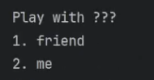
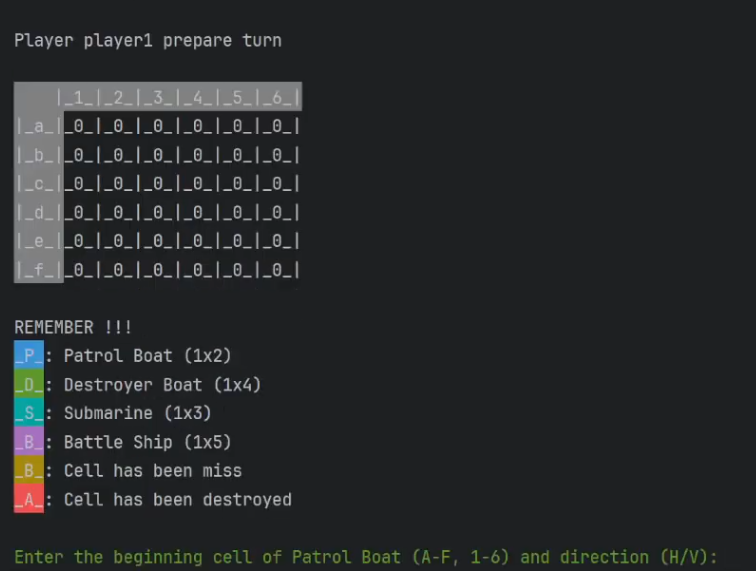
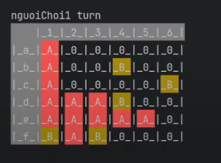

# SEA BATTLE

## Introduction

- Battleship Simulator is a turn-based action-strategy game inspired by the classic Battleship board game. Players can engage in PvP (Player vs Player) or PvE (Player vs Environment) battles against AI. The goal is to sink all opponent ships before your fleet is destroyed.

## Key Features

### Game Modes:

- PvP (Player vs Player): Two players take turns placing ships and attacking each other.

- PvE (Player vs Environment): Compete against AI with automatic ship placement and quick decision-making capabilities.
  
    

- Ship System:

  + Patrol Boat: Small and agile, occupies 2 tiles.

  + Destroyer Boat: Medium-sized warship, occupies 4 tiles.

  + Submarine: Versatile underwater vessel, occupies 3 tiles.

  + BattleShip: The largest ship, occupies 5 tiles.

    

- Customizable Board: Flexible board size as set by the player.

- Visual status indicators with colored feedback (hit/miss).
  
  

- How to Play

  + Choose a Mode:

    + friend: Enter names for two players, then manually place ships or use the auto-setup mode.

    + me: Enter the player name, then battle against DungNguyen.

  + Manual or Auto Actions:

    + During your turn, select x-y to attack.

    + Attack results (bull's eye/miss) are displayed immediately.

  + Final Outcome

    + The game ends when one side loses all their ships.

  + [Demo play](https://www.youtube.com/watch?v=awg4-hqYpog)

- System Requirements

  + JDK 8 or higher.

  + A console environment (CMD, Terminal, or IDE like IntelliJ, Eclipse).

  + Compatible with Windows, macOS, and Linux.

## Development Team

- Project Name: Sea Battle

 - Author: DungNguyenCoder

- Contact: [dungnickchinh1909@gmail.com]
